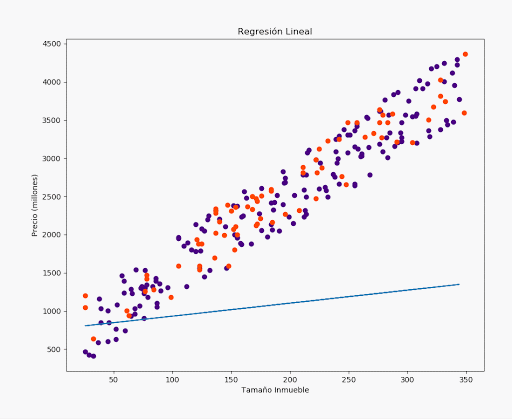

[`Análisis de Datos con Python`](../README.md) > `Sesión 7`

## Sesión 7: Regresión Lineal en Python

### 1. Objetivos :dart: 

- Aprender acerca de la regresión lineal, la neurona artificial de mono-entrada, la neurona artificial multi-entrada, 
  bases y fundamentos del entrenamiento supervisado y regresor Lineal.

### 2. Contenido :blue_book:

El contenido de esta sesión lo puedes encontrar en [GitBook](https://beduexpert.gitbook.io/data-analysis/sesion-07-regresion-con-python-machine-learning).

#### <ins>Definición de neuronas</ins>

   - [**`RETO 1`**](reto01/README.md)
   - [**`RETO 2`**](reto02/README.md)

#### <ins>Regresión líneal</ins>

   - [**`EJEMPLO 1`**](ejemplo01/README.md)
   - [**`RETO 3`**](reto03/README.md)

### 3. Postwork :memo:
Aplica lo todo lo que aprendiste durante la sesión a tu proyecto personal.

- [**`POSTWORK SESIÓN 7`**](postwork/README.md)

 

[`Anterior`](../sesion04/README.md) | `Siguiente`
