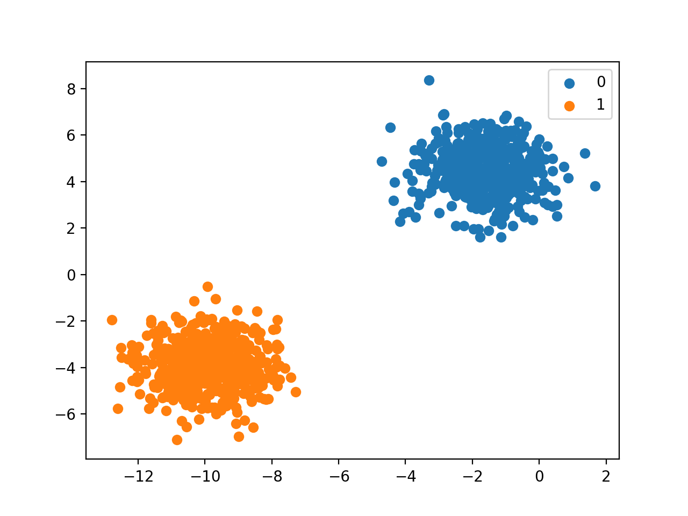

[`Análisis de Datos con Python`](../README.md) > `Sesión 8`

## Sesión 8: Clasificación con __Python:__ Fundamentos de Machine Learning

### 1. Objetivos :dart: 

- Aprender sobre clasificación no supervisada
- Aprender sobre la distancia euclidiana
- Aprender sobre el algoritmo de agrupamiento de K-Medias
- Aprender sobre clasificación supervisada
- Aprender sobre redes neuronales para clasificación binaria
- Aprender sobre redes neuronales para clasificación multi-categoría

### 2. Contenido :blue_book:

El contenido de esta sesión lo puedes encontrar en [GitBook](https://beduexpert.gitbook.io/data-analysis/sesion-08-clasificacion-con-python-machine-learning).

#### <ins>Distancia Euclidiana y K medias</ins>

   - [**`EJEMPLO 1`**](ejemplo01/README.md)
   - [**`RETO 1`**](reto01/README.md)
   - [**`RETO 2`**](reto02/README.md)

#### <ins>Separación de datos para entrenamiento supervisado</ins>

   - [**`EJEMPLO 2`**](ejemplo02/README.md)

#### <ins>Entrenamiento supervisado para clasificación binaria</ins>

   - [**`EJEMPLO 3`**](ejemplo03/README.md)
   - [**`RETO 3`**](reto03/README.md)

#### <ins>Entrenamiento supervisado para clasificación multi-categoría</ins>

   - [**`EJEMPLO 4`**](ejemplo04/README.md)
   - [**`RETO 4`**](reto04/README.md)

### 3. Postwork :memo:
Aplica lo todo lo que aprendiste durante la sesión a tu proyecto personal.

- [**`POSTWORK SESIÓN 8`**](postwork/README.md)

 

[`Anterior`](../sesion07/README.md) | [`Siguiente`](../sesion01/README.md)
